# Object Tracking with Semantic Pixel-Wise Convolutional Neural Networks

## Introduction

This project was developed for identifying vehicles in a video stream. The project is a corner stone for a real time vehicle tracking algorithm that employ semantic pixel-wise methods. This project solves the tracking problem for the Udacity final project using a different approach than that presented in the course. Instead of using the HOG features and other features extracted from the color space of the images, we used the U-Net[1] which is a  convolutional network for biomedical image segmentation. We modified the original network with batch normalization in keras in order to speed up the network. There are many benefits to using neural networks for segmentation and tracking such as improved accuracy and portability. ConvNetts generally capable of performing segmentation tasks by transforming fully connected layers into convolution layers that output a spatial map for end-to-end pixel wise learning [6]. In this submission we also discuss the internal covariant shift issue in ConvNets and test two implementations of the same neural network with and without batch normalization.

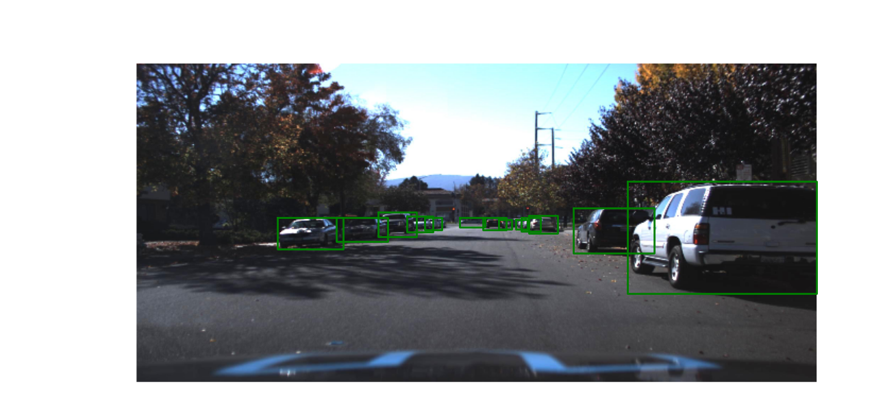

## Data Pre-processing 

We have implemented camera calibration routine to the video file, however we haven't calibrated the images from the datasets. However, each image was normalized and then smoothed with a Gaussian filter. In order to train the network, we have masked each image without covering the cars that were reported in the CSV file. The images were randomly processed with a brightness filter to help the network generalize to different lighting conditions. 

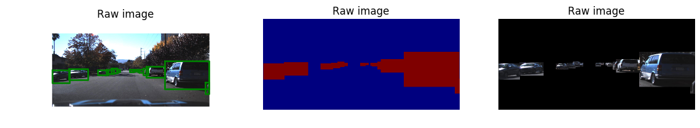


## U-Net Convolutional Network

The U-Net has been proposed as a solution for the dstl satellite imagery feature detection[2]. It was primarily chosen based on the evaluation of fast segmentation ConvNets by Fabian Tschopp[9].The U-Net has two sections 
• Contracting: Two convolutions followed by one max pooling layer.
• Expanding: Deconvolution followed by a convolution to reduce the number of feature maps, a mergecrop and two convolution layers.
In this project we used the U-Net original implantation as it was described in its original paper [1] and modified it for batch normalization.

## Batch Normalization

Internal covariant shift in deep neural networks affects the learning speed in ConvNets. Batch normalization was recently proposed to reduce the distribution of each layer’s input to accelerate the training process. It also reduces over fitting and eliminates the need for using dropout in the fully connected layers. In order to determine the usefulness of implementing batch normalization in neural networks that don’t use fully connected layers we evaluated the performance of encoder-decoder ConvNets with and without using batch normalization. We found that batch normalization increased the learning performance by 18% but also increased the learning time in each epoch by 26%. 
The figures below show the training accuracy plots from a U-Net with batch normalization implemented and without batch normalization implementation respectively. 

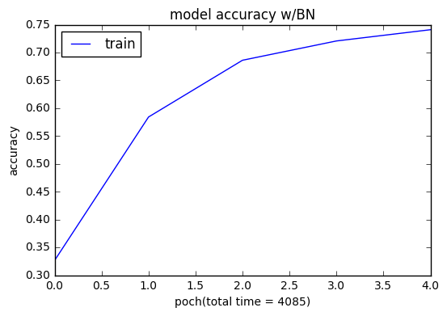
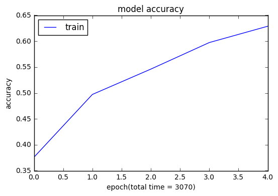
 

##  Jaccard similarity coefficient 

In evaluating the model I've investigated several metrics including the Mean IU[7] Intersection over Union [5] and the Jaccard coefficient [4]. The idea is to maximize the overlap between the predicted region and the ground truth bounding box.


We eventually decided to use the Jaccard coeef. The Jaccard similarity coefficient is defined as the size of the intersection divided by the size of the union of two regions. This metric is used to compare the predicted labels to a set of labels in y_true [4].

The coefficients are given by 

#### J(A,B) = |A∩B| / |A∪B|=|A∩B|/|A|+|B|-|A∩B| 

(If A and B are both empty, we define J(A,B) = 1.)

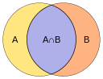
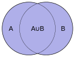
Image source [4]

## Training

The datasets were obtained from [11] and contained two sets of annotated data. The first batch of datasets contained over 65,000 labels that were obtained from 9,423 frames with a total size of 1.5GB. A Point Grey research cameras running at full resolution of 1920x1200 at 2hz were used in creating the images. The dataset was annotated by CrowdAI using a combination of machine learning and crowed sourcing. The second batch of datasets was similar to the first datasets but contained additional fields for occlusion and an additional label for traffic lights. The dataset was annotated entirely by humans using Autti and had 15,000 frames with a total size of 3.3GB.
 
We used Adam optimizer for training the network with a training rate of 1e-4. The used loss method was Binary Crossentropy. We used a GPU AWS node with 12GB Nvidia TitanX but despite using this machine the batch size was reduced to 1 image because increasing it crashed the machine. The total number of epochs was 5 with 3000 images each. The training time for each epoch was 817 seconds with batch normalization and 611 seconds without batch normalization. We have decided to train with 5 epochs only because increasing the number to 10 had a slight improve on the training accuracy from 75% to 78% only when the network with batch normalization was used. We have decided to use 3000 images only because the GPU occasionally crashed with sized larger than 5000 images. The figures for the training accuracy were shown 


## Results

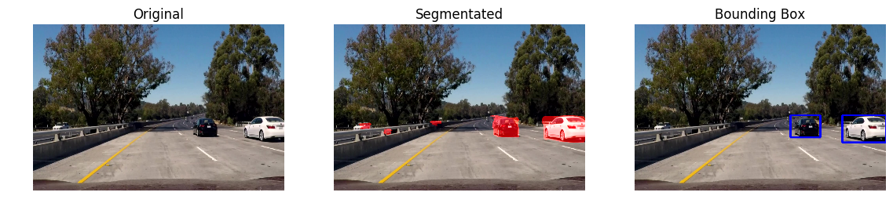
[](http://www.youtube.com/watch?v=IbvwsHkxv8E) 

## Reflections and limitations

This was an awesome project, I've  learned so much reading and implementing various approaches to solve it. I took an unorthodox approach to solving it by using Neural networks instead of computer vision. I'm currently improving it by applying new techniques to turn the project into a tracking algorithms with neural networks. I will also improve the algorithm to remove the false positive detection seen in some frames. I will also test a mIoU metric for evaluating the network because it is a more stringent metric than class average accuracy since it penalizes false positive predictions[8]. 

## Acknowledgment

I can't thank Udacity enough for this great opportunity to learn state-of-the-art technology. The course materials and provided methods were the foundation for the project. I've also learned so much from Stanford university's  deep learning course [3] which was very helpful in selecting what ConvNet I should choose. I would like to give credits to Artur Kuzin who's code on kaggle [2] was very helpful in solving sticky problems. This work could have not been possible without the fascinating posts of Vivek Yadav [12] who was an inspiration and helpful is solving countless problems. Finally, this repository [10] was a great source for segmentation techniques using ConvNets. 


## Refrences 
[1]https://arxiv.org/abs/1505.04597

[2]https://www.kaggle.com/drn01z3/dstl-satellite-imagery-feature-detection/end-to-end-baseline-with-u-net-keras/code

[3]Stanford University CS224d: Deep Learning for Natural Language, https://www.youtube.com/watch?v=2xtx-gk3PqY

[4]https://en.wikipedia.org/wiki/Jaccard_index

[5]http://www.pyimagesearch.com/2016/11/07/intersection-over-union-iou-for-object-detection/

[6]https://arxiv.org/pdf/1605.06211.pdf

[7]https://github.com/martinkersner/py_img_seg_eval

[8]https://arxiv.org/pdf/1511.00561.pdf

[9]https://arxiv.org/pdf/1509.03371.pdf

[10]https://github.com/kjw0612/awesome-deep-vision

[11]https://github.com/edrones/self-driving-car/tree/master/annotations

[12]https://chatbotslife.com/small-u-net-for-vehicle-detection-9eec216f9fd6#.45e4cn1xk


```python
% matplotlib inline
import cv2
import matplotlib.pyplot as plt
from matplotlib.patches import Rectangle
from moviepy.editor import VideoFileClip
from IPython.display import HTML
import numpy as np
import glob
import time
from keras.models import Model
from keras.layers import Input, merge, Convolution2D, MaxPooling2D, UpSampling2D,Lambda
from keras.optimizers import Adam
from keras.callbacks import ModelCheckpoint, LearningRateScheduler
from keras import backend as K
from scipy.ndimage.measurements import label
import pandas as pd
import keras.backend as K
from sklearn.metrics import jaccard_similarity_score
from keras.layers import Input, Dense, BatchNormalization, merge, Activation
import time
```


```python
## Read in data from "object detection crowdai" and plot it to check for any issues with the datasets

data_15GB = pd.read_csv('object-detection-crowdai/labels.csv', header=0)


data_15GB.head()

```


<div>
<table border="1" class="dataframe">
  <thead>
    <tr style="text-align: right;">
      <th></th>
      <th>xmin</th>
      <th>xmax</th>
      <th>ymin</th>
      <th>ymax</th>
      <th>Frame</th>
      <th>Label</th>
      <th>Preview URL</th>
    </tr>
  </thead>
  <tbody>
    <tr>
      <th>0</th>
      <td>785</td>
      <td>533</td>
      <td>905</td>
      <td>644</td>
      <td>1479498371963069978.jpg</td>
      <td>Car</td>
      <td>http://crowdai.com/images/Wwj-gorOCisE7uxA/vis...</td>
    </tr>
    <tr>
      <th>1</th>
      <td>89</td>
      <td>551</td>
      <td>291</td>
      <td>680</td>
      <td>1479498371963069978.jpg</td>
      <td>Car</td>
      <td>http://crowdai.com/images/Wwj-gorOCisE7uxA/vis...</td>
    </tr>
    <tr>
      <th>2</th>
      <td>268</td>
      <td>546</td>
      <td>383</td>
      <td>650</td>
      <td>1479498371963069978.jpg</td>
      <td>Car</td>
      <td>http://crowdai.com/images/Wwj-gorOCisE7uxA/vis...</td>
    </tr>
    <tr>
      <th>3</th>
      <td>455</td>
      <td>522</td>
      <td>548</td>
      <td>615</td>
      <td>1479498371963069978.jpg</td>
      <td>Truck</td>
      <td>http://crowdai.com/images/Wwj-gorOCisE7uxA/vis...</td>
    </tr>
    <tr>
      <th>4</th>
      <td>548</td>
      <td>522</td>
      <td>625</td>
      <td>605</td>
      <td>1479498371963069978.jpg</td>
      <td>Truck</td>
      <td>http://crowdai.com/images/Wwj-gorOCisE7uxA/vis...</td>
    </tr>
  </tbody>
</table>
</div>


```python
# the majority of labels are for cars and therefore I decided to train the classifier 

car_label = data_15GB[(data_15GB['Label']=='Car')]
truck_label = data_15GB[(data_15GB['Label']=='Truck')]
print ("Car Label",len(car_label))
print ("Truck Label",len(truck_label))
```

    Car Label 62570
    Truck Label 3819


```python
# Perform data cleanup and getrid on the fields that aren't required such as the URL
cars_15GB = data_15GB[(data_15GB['Label']=='Car') | (data_15GB['Label']=='Truck')].reset_index()
cars_15GB  = cars_15GB.drop('index', 1)
cars_15GB['File_Path'] =  'object-detection-crowdai' + '/' +cars_15GB['Frame']
cars_15GB  = cars_15GB.drop('Preview URL', 1)
cars_15GB.head()
```


<div>
<table border="1" class="dataframe">
  <thead>
    <tr style="text-align: right;">
      <th></th>
      <th>xmin</th>
      <th>xmax</th>
      <th>ymin</th>
      <th>ymax</th>
      <th>Frame</th>
      <th>Label</th>
      <th>File_Path</th>
    </tr>
  </thead>
  <tbody>
    <tr>
      <th>0</th>
      <td>785</td>
      <td>533</td>
      <td>905</td>
      <td>644</td>
      <td>1479498371963069978.jpg</td>
      <td>Car</td>
      <td>object-detection-crowdai/1479498371963069978.jpg</td>
    </tr>
    <tr>
      <th>1</th>
      <td>89</td>
      <td>551</td>
      <td>291</td>
      <td>680</td>
      <td>1479498371963069978.jpg</td>
      <td>Car</td>
      <td>object-detection-crowdai/1479498371963069978.jpg</td>
    </tr>
    <tr>
      <th>2</th>
      <td>268</td>
      <td>546</td>
      <td>383</td>
      <td>650</td>
      <td>1479498371963069978.jpg</td>
      <td>Car</td>
      <td>object-detection-crowdai/1479498371963069978.jpg</td>
    </tr>
    <tr>
      <th>3</th>
      <td>455</td>
      <td>522</td>
      <td>548</td>
      <td>615</td>
      <td>1479498371963069978.jpg</td>
      <td>Truck</td>
      <td>object-detection-crowdai/1479498371963069978.jpg</td>
    </tr>
    <tr>
      <th>4</th>
      <td>548</td>
      <td>522</td>
      <td>625</td>
      <td>605</td>
      <td>1479498371963069978.jpg</td>
      <td>Truck</td>
      <td>object-detection-crowdai/1479498371963069978.jpg</td>
    </tr>
  </tbody>
</table>
</div>


```python


# Read in data from "objectdataset" and plot it to check for any issues with the datasets. The datasets aren't labeled
# and contain classes other than cars and trucks 

data_35GB = pd.read_csv('object-dataset/labels.csv', header=0)
data_35GB.head()

 
```


<div>
<table border="1" class="dataframe">
  <thead>
    <tr style="text-align: right;">
      <th></th>
      <th>1478019952686311006.jpg</th>
      <th>950</th>
      <th>574</th>
      <th>1004</th>
      <th>620</th>
      <th>0</th>
      <th>car</th>
      <th>Unnamed: 7</th>
    </tr>
  </thead>
  <tbody>
    <tr>
      <th>0</th>
      <td>1478019952686311006.jpg</td>
      <td>1748</td>
      <td>482</td>
      <td>1818</td>
      <td>744</td>
      <td>0</td>
      <td>pedestrian</td>
      <td>NaN</td>
    </tr>
    <tr>
      <th>1</th>
      <td>1478019953180167674.jpg</td>
      <td>872</td>
      <td>586</td>
      <td>926</td>
      <td>632</td>
      <td>0</td>
      <td>car</td>
      <td>NaN</td>
    </tr>
    <tr>
      <th>2</th>
      <td>1478019953689774621.jpg</td>
      <td>686</td>
      <td>566</td>
      <td>728</td>
      <td>618</td>
      <td>1</td>
      <td>truck</td>
      <td>NaN</td>
    </tr>
    <tr>
      <th>3</th>
      <td>1478019953689774621.jpg</td>
      <td>716</td>
      <td>578</td>
      <td>764</td>
      <td>622</td>
      <td>0</td>
      <td>car</td>
      <td>NaN</td>
    </tr>
    <tr>
      <th>4</th>
      <td>1478019953689774621.jpg</td>
      <td>826</td>
      <td>580</td>
      <td>880</td>
      <td>626</td>
      <td>0</td>
      <td>car</td>
      <td>NaN</td>
    </tr>
  </tbody>
</table>
</div>


```python
data_35GB.columns= ['Frame',  'xmin', 'xmax', 'ymin','ymax', 'class', 'Label','Unnamed']
car_label = data_35GB[(data_35GB['Label']=='car')]
truck_label = data_35GB[(data_35GB['Label']=='truck')]
pedestrian_label = data_35GB[(data_35GB['Label']=='pedestrian')]
everything_else_label = data_35GB[(data_35GB['Label']!='pedestrian')&(data_35GB['Label']!='truck')&(data_35GB['Label']!='car')]
print ("Car Labels",len(car_label))
print ("Truck Labels",len(truck_label))
print ("Pedestrian labels",len(pedestrian_label))
print ("everything else label",len(everything_else_label))
```

    Car Labels 60787
    Truck Labels 3503
    Pedestrian labels 9866
    everything else label 18929


```python
cars_35GB = data_35GB[(data_35GB['Label']=='car') | (data_35GB['Label']=='truck')].reset_index()
cars_35GB = cars_35GB.drop('index', 1)
cars_35GB = cars_35GB.drop('class', 1)
cars_35GB = cars_35GB.drop('Unnamed', 1)
cars_35GB['File_Path'] =  'object-dataset' + '/' +cars_35GB['Frame']
cars_35GB.head() 

```


<div>
<table border="1" class="dataframe">
  <thead>
    <tr style="text-align: right;">
      <th></th>
      <th>Frame</th>
      <th>xmin</th>
      <th>xmax</th>
      <th>ymin</th>
      <th>ymax</th>
      <th>Label</th>
      <th>File_Path</th>
    </tr>
  </thead>
  <tbody>
    <tr>
      <th>0</th>
      <td>1478019953180167674.jpg</td>
      <td>872</td>
      <td>586</td>
      <td>926</td>
      <td>632</td>
      <td>car</td>
      <td>object-dataset/1478019953180167674.jpg</td>
    </tr>
    <tr>
      <th>1</th>
      <td>1478019953689774621.jpg</td>
      <td>686</td>
      <td>566</td>
      <td>728</td>
      <td>618</td>
      <td>truck</td>
      <td>object-dataset/1478019953689774621.jpg</td>
    </tr>
    <tr>
      <th>2</th>
      <td>1478019953689774621.jpg</td>
      <td>716</td>
      <td>578</td>
      <td>764</td>
      <td>622</td>
      <td>car</td>
      <td>object-dataset/1478019953689774621.jpg</td>
    </tr>
    <tr>
      <th>3</th>
      <td>1478019953689774621.jpg</td>
      <td>826</td>
      <td>580</td>
      <td>880</td>
      <td>626</td>
      <td>car</td>
      <td>object-dataset/1478019953689774621.jpg</td>
    </tr>
    <tr>
      <th>4</th>
      <td>1478019953689774621.jpg</td>
      <td>1540</td>
      <td>488</td>
      <td>1680</td>
      <td>608</td>
      <td>car</td>
      <td>object-dataset/1478019953689774621.jpg</td>
    </tr>
  </tbody>
</table>
</div>


```python

cars_15_35GB = pd.concat([cars_15GB,cars_35GB]).reset_index()
cars_15_35GB = cars_15_35GB.drop('index',1)
cars_15_35GB.columns =['File_Path','Frame','Label','ymin','xmin','ymax','xmax']
cars_15_35GB.head()
print(len(cars_15_35GB))
```

    130679


```python
#test we have the correct pathname
file_name = cars_15_35GB['File_Path'][1]
img_name = file_name.split('/',1)[1]
print(img_name)
print(file_name)
```

    1479498371963069978.jpg
    object-detection-crowdai/1479498371963069978.jpg


```python
#Method to read image. CV2 reads images in BGR and the simulator provides images in RGB. Therefore convert to 
#RGB domain
def read_img(img):
    img = cv2.imread(img)
    img = cv2.cvtColor(img,cv2.COLOR_BGR2RGB)
    return img

#Image brigtness changing method, based on Vivek Yadav's [2] approach for changing image brightness
def brightness_images(img):
    post_img = cv2.cvtColor(img,cv2.COLOR_RGB2HSV)
    random_bright = .25+np.random.uniform()
    post_img[:,:,2] = np.multiply(post_img[:,:,2],random_bright)
    post_img = cv2.cvtColor(post_img,cv2.COLOR_HSV2RGB)
    return post_img
# Another approach to adjust brightness used for experimentation 
def brightness_images_2(img):
    hsv = cv2.cvtColor(img, cv2.COLOR_BGR2HSV)  
    h, s, v = cv2.split(hsv)
    v += 255
    final_hsv = cv2.merge((h, s, v))
    img = cv2.cvtColor(final_hsv, cv2.COLOR_HSV2BGR)
    return img
# Resize the image to the givin dimensions 
def resize_img(image, col, row):
    image = cv2.resize(image, (col,row), interpolation=cv2.INTER_AREA)
    return image
# Crop away the car hood from the orginal image  
def crop_img(img):
    shape = img.shape
    img = img[0:shape[0]-20,0:shape[1]]
    img = resize_img(img, 64, 64)
    return img

# Define a function to draw bounding boxes
def draw_boxes(img, bboxes, color=(0, 0, 255), thick=6):
    # Make a copy of the image
    imcopy = np.copy(img)
    # Iterate through the bounding boxes
    for bbox in bboxes:
        # Draw a rectangle given bbox coordinates
        cv2.rectangle(imcopy, bbox[0], bbox[1], color, thick)
    # Return the image copy with boxes drawn
    return imcopy
def gaussian_noise(img, kernel_size):
    """Applies a Gaussian Noise kernel"""
    return cv2.GaussianBlur(img, (kernel_size, kernel_size), 0)

def transform(img):
    imshape = img.shape
    img_size = (img.shape[1], img.shape[0])
    #src=np.float32([[160,imshape[0]],[imshape[1]/2-60, imshape[0]/2+90],[imshape[1]/2+100, imshape[0]/2+90], [imshape[1]-20,imshape[0]]])
    #dst=np.float32([[(240,imshape[0]),(240, 0),(imshape[1]-130, 0), (imshape[1]-130,imshape[0])]])
    src = np.float32([[490, 482],[810, 482],
                     [1250, 720],[40, 720]])
    dst = np.float32([[0, 0], [1280, 0], 
                     [1250, 720],[40, 720]])
    
    M = cv2.getPerspectiveTransform(src, dst)
    Minv = cv2.getPerspectiveTransform(dst, src)
    wraped =  cv2.warpPerspective(img,M,img_size, flags=cv2.INTER_LINEAR)
    
    return  Minv, wraped


def draw_boxes(img, bboxes, color=(0, 0, 255), thick=6):
    # Make a copy of the image
    imcopy = np.copy(img)
    # Iterate through the bounding boxes
    for bbox in bboxes:
        # Draw a rectangle given bbox coordinates
        cv2.rectangle(imcopy, bbox[0], bbox[1], color, thick)
    # Return the image copy with boxes drawn
    return imcopy

#Implement calibration on the images that will be used
def undistort(img, read=True, display=True, write=False):

# Test undistortion on an image
    
    if read:
        img = cv2.imread(img)
    img_size = (img.shape[1], img.shape[0])
#img = cv2.cvtColor(dst, cv2.COLOR_BGR2RGB)
# Do camera calibration given object points and image points
    ret, mtx, dist, rvecs, tvecs = cv2.calibrateCamera(objpoints, imgpoints, img_size,None,None)
    dst = cv2.undistort(img, mtx, dist, None, mtx)
#dst = cv2.cvtColor(dst, cv2.COLOR_RGB2BGR)
    if write:
        cv2.imwrite('Undistorted/test6.jpg',dst)
# Save the camera calibration result for later use (we won't worry about rvecs / tvecs)
#dist_pickle = {}
#dist_pickle["mtx"] = mtx
#dist_pickle["dist"] = dist
#pickle.dump( dist_pickle, open( "calibration_wide/wide_dist_pickle.p", "wb" ) )
#dst = cv2.cvtColor(dst, cv2.COLOR_BGR2RGB)
# Visualize undistortion
    if display:
        f, (ax1, ax2) = plt.subplots(1, 2, figsize=(20,10))
        img_RGB=cv2.cvtColor(img, cv2.COLOR_BGR2RGB)
        ax1.imshow(img_RGB)
        ax1.set_title('Original Image', fontsize=30)
        dst_RGB=cv2.cvtColor(dst, cv2.COLOR_BGR2RGB)
        ax2.imshow(dst_RGB)
        ax2.set_title('Undistorted Image', fontsize=30)
    else:
        return dst

```


```python
## Method to get the image and resize it if required
def im_read(img_path,classID,resize = True, size=(640,300),augumentation=True, display=True):
    #Return the index at which the image is first found in a list - Python
    file_name = img_path['File_Path'][classID]
    #img = read_img(file_name)
    img = cv2.imread(file_name)
    img_size = np.shape(img)
    #print(img_size )
    img = cv2.cvtColor(img,cv2.COLOR_BGR2RGB)
    if resize == True:
        img = cv2.resize(img,size)
    if augumentation == True:
        img = brightness_images(img)
    #str.split(str="", num=string.count(str)).
    img_name = file_name.split('/',1)[1]
    bb_boxes = img_path[img_path['Frame'] == img_name].reset_index()
    img_size_post = np.shape(img)  
    bb_boxes['xmin'] = np.round(bb_boxes['xmin']/img_size[1]*img_size_post[1])
    bb_boxes['xmax'] = np.round(bb_boxes['xmax']/img_size[1]*img_size_post[1])
    bb_boxes['ymin'] = np.round(bb_boxes['ymin']/img_size[0]*img_size_post[0])
    bb_boxes['ymax'] = np.round(bb_boxes['ymax']/img_size[0]*img_size_post[0])
    bb_boxes['Area'] = (bb_boxes['xmax']- bb_boxes['xmin'])*(bb_boxes['ymax']- bb_boxes['ymin']) 
    if display == True:
        plt.figure(figsize=(16,10))
        plt.subplot(1,1,1)
        plot_im_bbox(img,bb_boxes)
    return img_name,img,bb_boxes

def get_mask_seg(img,bb_boxes_f):
    img_mask = np.zeros_like(img[:,:,0])
    for i in range(len(bb_boxes_f)):
        bb_box_i = [bb_boxes_f.iloc[i]['xmin'],bb_boxes_f.iloc[i]['ymin'],
                bb_boxes_f.iloc[i]['xmax'],bb_boxes_f.iloc[i]['ymax']]
        img_mask[bb_box_i[1]:bb_box_i[3],bb_box_i[0]:bb_box_i[2]]= 1.
        img_mask = np.reshape(img_mask,(np.shape(img_mask)[0],np.shape(img_mask)[1],1))
    return img_mask

def plot_bbox(bb_boxes,ind_bb,color='r',linewidth=2):
    bb_box_i = [bb_boxes.iloc[ind_bb]['xmin'],
                bb_boxes.iloc[ind_bb]['ymin'],
                bb_boxes.iloc[ind_bb]['xmax'],
                bb_boxes.iloc[ind_bb]['ymax']]
    plt.plot([bb_box_i[0],bb_box_i[2],bb_box_i[2],
                  bb_box_i[0],bb_box_i[0]],
             [bb_box_i[1],bb_box_i[1],bb_box_i[3],
                  bb_box_i[3],bb_box_i[1]],
             color,linewidth=linewidth)
def plot_im_bbox(im,bb_boxes):
    plt.imshow(im)
    for i in range(len(bb_boxes)):
        plot_bbox(bb_boxes,i,'g')

        bb_box_i = [bb_boxes.iloc[i]['xmin'],bb_boxes.iloc[i]['ymin'],
                bb_boxes.iloc[i]['xmax'],bb_boxes.iloc[i]['ymax']]
    plt.axis('off'); 
 
```


```python
test_img_name,img,bb_boxes = im_read(cars_15_35GB,120,resize = True, size=(640,300), augumentation=False, display = True)
```


```python
# Test an image with it's bounding boxes
#print (cars_15_35GB)
test_img_name,img,bb_boxes = im_read(cars_15_35GB,100,resize = True, size=(640,300), augumentation=False, display = False)
img_masked = get_mask_seg(img,bb_boxes)
plt.figure(figsize=(14,8))
plt.subplot(1,3,1)
plot_im_bbox(img,bb_boxes)
plt.title('Raw image')
plt.axis('off')
plt.subplot(1,3,2)
plt.imshow(img_masked[:,:,0])
plt.title('Raw image')
plt.axis('off')
plt.subplot(1,3,3)
plt.imshow(cv2.bitwise_and(img,img,mask=img_masked))
plt.title('Raw image')
plt.axis('off')
```


    (-0.5, 639.5, 299.5, -0.5)


```python
def generate_train_batch(data,batch_size):
    #col=size[0]
    #row=size[1]
    batch_images = np.zeros((batch_size, row, col, 3))
    #batch_steering = np.zeros(batch_size)
    batch_masks = np.zeros((batch_size, row, col, 1))
    training_batch = len(data)-100000
    while 1:
        for i_batch in range(batch_size):
            
            process_line = np.random.randint(training_batch)
            #generator_csv= data.iloc[[process_line]].reset_index()
            #x,y = all_filters_train(generator_csv)
            #print(data)
            img_name,img,bb_boxes = im_read(data,process_line,resize = True, size=(col,row), augumentation=True, display = False)
            img_masked = get_mask_seg(img,bb_boxes)
            batch_images[i_batch] = img
            batch_masks[i_batch] = img_masked
        yield batch_images, batch_masks

def generate_test_batch(data,batch_size):
    batch_images = np.zeros((batch_size, row, col, 3))
    #batch_steering = np.zeros(batch_size)
    batch_masks = np.zeros((batch_size, row, col, 1))
    training_batch = len(data)-100000
    while 1:
        for i_batch in range(batch_size):
            process_line = np.random.randint(training_batch)
            process_line = process_line+training_batch
            #generator_csv= data.iloc[[process_line]].reset_index()
            #x,y = all_filters_train(generator_csv)
            img_name,img,bb_boxes = im_read(data,process_line,resize = True, size=(col,row), augumentation=True, display = False)
            img_masked = get_mask_seg(img,bb_boxes)
            batch_images[i_batch] = img
            batch_masks[i_batch] = img_masked
        yield batch_images, batch_masks
"""        
def generate_validation_patch(data):
    while 1:
        for process_line in range(len(data)):
            generator_csv = data.iloc[[process_line]].reset_index()
            x = all_filters_validate(data)
            x = x.reshape(1, x.shape[0], x.shape[1], x.shape[2])
            y = generator_csv['steering'][0]
            y = np.array([[y]])
            yield x, y
def save_model(fileModelJSON,fileWeights):
    if Path(fileModelJSON).is_file():
        os.remove(fileModelJSON)
    json_string = model.to_json()
    with open(fileModelJSON,'w' ) as f:
        json.dump(json_string, f)
    if Path(fileWeights).is_file():
        os.remove(fileWeights)
    model.save_weights(fileWeights)
    
"""
```


    "        \ndef generate_validation_patch(data):\n    while 1:\n        for process_line in range(len(data)):\n            generator_csv = data.iloc[[process_line]].reset_index()\n            x = all_filters_validate(data)\n            x = x.reshape(1, x.shape[0], x.shape[1], x.shape[2])\n            y = generator_csv['steering'][0]\n            y = np.array([[y]])\n            yield x, y\ndef save_model(fileModelJSON,fileWeights):\n    if Path(fileModelJSON).is_file():\n        os.remove(fileModelJSON)\n    json_string = model.to_json()\n    with open(fileModelJSON,'w' ) as f:\n        json.dump(json_string, f)\n    if Path(fileWeights).is_file():\n        os.remove(fileWeights)\n    model.save_weights(fileWeights)\n    \n"


```python
row = 640
col = 960
```


```python
# for custom metrics
#custom metrix source : https://keras.io/metrics/
#Use this as a template
#def mean_pred(y_true, y_pred):
    #return K.mean(y_pred)

#def false_rates(y_true, y_pred):
    #false_neg = ...
    #false_pos = ...
    #return {
        #'false_neg': false_neg,
        #'false_pos': false_pos,
    #}

#model.compile(optimizer='rmsprop',
              #loss='binary_crossentropy',
             # metrics=['accuracy', mean_pred, false_rates])

def jaccard_coef(y_true, y_pred):
    # __author__ = Vladimir Iglovikov
    intersection = K.sum(y_true * y_pred, axis=[0, -1, -2])
    sum_ = K.sum(y_true + y_pred, axis=[0, -1, -2])

    jac = (intersection + smooth) / (sum_ - intersection + smooth)

    return K.mean(jac)

def jaccard_coef_int(y_true, y_pred):
    # __author__ = Vladimir Iglovikov
    y_pred_pos = K.round(K.clip(y_pred, 0, 1))

    intersection = K.sum(y_true * y_pred_pos, axis=[0, -1, -2])
    sum_ = K.sum(y_true + y_pred, axis=[0, -1, -2])
    jac = (intersection + smooth) / (sum_ - intersection + smooth)
    return K.mean(jac)

#to do: fbeta_score(y_true, y_pred, beta=1) 


```


```python
# U-Net with batch normalization

def get_small_unet():
    inputs = Input((row,col,3))
    inputs_norm = Lambda(lambda x: x/127.5 - 1.)
    
    ##
    #layer=Dense(d, init='glorot_normal', bias=True)(x)
    #layer=BatchNormalization()(layer)
    #layer=Activation('relu')(layer)
    
    conv1 = Convolution2D(8, 3, 3, border_mode='same')(inputs)
    conv1 = BatchNormalization()(conv1)
    conv1 = Activation('relu')(conv1)
    
    conv1 = Convolution2D(8, 3, 3, border_mode='same')(conv1)
    conv1 = BatchNormalization()(conv1)
    conv1 = Activation('relu')(conv1)
    pool1 = MaxPooling2D(pool_size=(2, 2))(conv1)

    conv2 = Convolution2D(16, 3, 3, border_mode='same')(pool1)
    conv2 = BatchNormalization()(conv2)
    conv2 = Activation('relu')(conv2)
    
    
    conv2 = Convolution2D(16, 3, 3, border_mode='same')(conv2)
    conv2 = BatchNormalization()(conv2)
    conv2 = Activation('relu')(conv2)
    pool2 = MaxPooling2D(pool_size=(2, 2))(conv2)

    conv3 = Convolution2D(32, 3, 3, border_mode='same')(pool2)
    conv3 = BatchNormalization()(conv3)
    conv3 = Activation('relu')(conv3)
    
    
    conv3 = Convolution2D(32, 3, 3, border_mode='same')(conv3)
    conv3 = BatchNormalization()(conv3)
    conv3 = Activation('relu')(conv3)
    pool3 = MaxPooling2D(pool_size=(2, 2))(conv3)

    conv4 = Convolution2D(64, 3, 3, border_mode='same')(pool3)
    conv4 = BatchNormalization()(conv4)
    conv4 = Activation('relu')(conv4)
    
    conv4 = Convolution2D(64, 3, 3, border_mode='same')(conv4)
    conv4 = BatchNormalization()(conv4)
    conv4 = Activation('relu')(conv4)
    pool4 = MaxPooling2D(pool_size=(2, 2))(conv4)

    conv5 = Convolution2D(128, 3, 3, border_mode='same')(pool4)
    conv5 = BatchNormalization()(conv5)
    conv5 = Activation('relu')(conv5)
    
    conv5 = Convolution2D(128, 3, 3, border_mode='same')(conv5)
    conv5 = BatchNormalization()(conv5)
    conv5 = Activation('relu')(conv5)

    up6 = merge([UpSampling2D(size=(2, 2))(conv5), conv4], mode='concat', concat_axis=3)
    conv6 = Convolution2D(64, 3, 3, border_mode='same')(up6)
    conv6 = BatchNormalization()(conv6)
    conv6 = Activation('relu')(conv6)
    
    conv6 = Convolution2D(64, 3, 3, border_mode='same')(conv6)
    conv6 = BatchNormalization()(conv6)
    conv6 = Activation('relu')(conv6)

    up7 = merge([UpSampling2D(size=(2, 2))(conv6), conv3], mode='concat', concat_axis=3)
    conv7 = Convolution2D(32, 3, 3, border_mode='same')(up7)
    conv7 = BatchNormalization()(conv7)
    conv7 = Activation('relu')(conv7)
    
    conv7 = Convolution2D(32, 3, 3, border_mode='same')(conv7)
    conv7 = BatchNormalization()(conv7)
    conv7 = Activation('relu')(conv7)

    up8 = merge([UpSampling2D(size=(2, 2))(conv7), conv2], mode='concat', concat_axis=3)
    conv8 = Convolution2D(16, 3, 3, border_mode='same')(up8)
    conv8 = BatchNormalization()(conv8)
    conv8 = Activation('relu')(conv8)
    
    
    conv8 = Convolution2D(16, 3, 3, border_mode='same')(conv8)
    conv8 = BatchNormalization()(conv8)
    conv8 = Activation('relu')(conv8)

    up9 = merge([UpSampling2D(size=(2, 2))(conv8), conv1], mode='concat', concat_axis=3)
    conv9 = Convolution2D(8, 3, 3, border_mode='same')(up9)
    conv9 = BatchNormalization()(conv9)
    conv9 = Activation('relu')(conv9)
    
    conv9 = Convolution2D(8, 3, 3, border_mode='same')(conv9)
    conv9 = BatchNormalization()(conv9)
    conv9 = Activation('relu')(conv9)

    conv10 = Convolution2D(1, 1, 1, activation='sigmoid')(conv9)

    model = Model(input=inputs, output=conv10)

    
    return model

```


```python
# U-Net without batch normalization
"""
def get_small_unet():
    inputs = Input((img_rows, img_cols,3))
    inputs_norm = Lambda(lambda x: x/127.5 - 1.)
    conv1 = Convolution2D(8, 3, 3, activation='relu', border_mode='same')(inputs)
    conv1 = Convolution2D(8, 3, 3, activation='relu', border_mode='same')(conv1)
    pool1 = MaxPooling2D(pool_size=(2, 2))(conv1)

    conv2 = Convolution2D(16, 3, 3, activation='relu', border_mode='same')(pool1)
    conv2 = Convolution2D(16, 3, 3, activation='relu', border_mode='same')(conv2)
    pool2 = MaxPooling2D(pool_size=(2, 2))(conv2)

    conv3 = Convolution2D(32, 3, 3, activation='relu', border_mode='same')(pool2)
    conv3 = Convolution2D(32, 3, 3, activation='relu', border_mode='same')(conv3)
    pool3 = MaxPooling2D(pool_size=(2, 2))(conv3)

    conv4 = Convolution2D(64, 3, 3, activation='relu', border_mode='same')(pool3)
    conv4 = Convolution2D(64, 3, 3, activation='relu', border_mode='same')(conv4)
    pool4 = MaxPooling2D(pool_size=(2, 2))(conv4)

    conv5 = Convolution2D(128, 3, 3, activation='relu', border_mode='same')(pool4)
    conv5 = Convolution2D(128, 3, 3, activation='relu', border_mode='same')(conv5)

    up6 = merge([UpSampling2D(size=(2, 2))(conv5), conv4], mode='concat', concat_axis=3)
    conv6 = Convolution2D(64, 3, 3, activation='relu', border_mode='same')(up6)
    conv6 = Convolution2D(64, 3, 3, activation='relu', border_mode='same')(conv6)

    up7 = merge([UpSampling2D(size=(2, 2))(conv6), conv3], mode='concat', concat_axis=3)
    conv7 = Convolution2D(32, 3, 3, activation='relu', border_mode='same')(up7)
    conv7 = Convolution2D(32, 3, 3, activation='relu', border_mode='same')(conv7)

    up8 = merge([UpSampling2D(size=(2, 2))(conv7), conv2], mode='concat', concat_axis=3)
    conv8 = Convolution2D(16, 3, 3, activation='relu', border_mode='same')(up8)
    conv8 = Convolution2D(16, 3, 3, activation='relu', border_mode='same')(conv8)

    up9 = merge([UpSampling2D(size=(2, 2))(conv8), conv1], mode='concat', concat_axis=3)
    conv9 = Convolution2D(8, 3, 3, activation='relu', border_mode='same')(up9)
    conv9 = Convolution2D(8, 3, 3, activation='relu', border_mode='same')(conv9)

    conv10 = Convolution2D(1, 1, 1, activation='sigmoid')(conv9)

    model = Model(input=inputs, output=conv10)


    return model
"""
```


```python
### Generator 

training_gen = generate_train_batch(cars_15_35GB,1)
smooth = 1.
model = get_small_unet()
model.compile(optimizer=Adam(lr=1e-4), loss='binary_crossentropy', metrics=[jaccard_coef, jaccard_coef_int, 'accuracy'])
```


```python
model.summary()
```

    ____________________________________________________________________________________________________
    Layer (type)                     Output Shape          Param #     Connected to                     
    ====================================================================================================
    input_3 (InputLayer)             (None, 640, 960, 3)   0                                            
    ____________________________________________________________________________________________________
    convolution2d_39 (Convolution2D) (None, 640, 960, 8)   224         input_3[0][0]                    
    ____________________________________________________________________________________________________
    batchnormalization_37 (BatchNorm (None, 640, 960, 8)   32          convolution2d_39[0][0]           
    ____________________________________________________________________________________________________
    activation_37 (Activation)       (None, 640, 960, 8)   0           batchnormalization_37[0][0]      
    ____________________________________________________________________________________________________
    convolution2d_40 (Convolution2D) (None, 640, 960, 8)   584         activation_37[0][0]              
    ____________________________________________________________________________________________________
    batchnormalization_38 (BatchNorm (None, 640, 960, 8)   32          convolution2d_40[0][0]           
    ____________________________________________________________________________________________________
    activation_38 (Activation)       (None, 640, 960, 8)   0           batchnormalization_38[0][0]      
    ____________________________________________________________________________________________________
    maxpooling2d_9 (MaxPooling2D)    (None, 320, 480, 8)   0           activation_38[0][0]              
    ____________________________________________________________________________________________________
    convolution2d_41 (Convolution2D) (None, 320, 480, 16)  1168        maxpooling2d_9[0][0]             
    ____________________________________________________________________________________________________
    batchnormalization_39 (BatchNorm (None, 320, 480, 16)  64          convolution2d_41[0][0]           
    ____________________________________________________________________________________________________
    activation_39 (Activation)       (None, 320, 480, 16)  0           batchnormalization_39[0][0]      
    ____________________________________________________________________________________________________
    convolution2d_42 (Convolution2D) (None, 320, 480, 16)  2320        activation_39[0][0]              
    ____________________________________________________________________________________________________
    batchnormalization_40 (BatchNorm (None, 320, 480, 16)  64          convolution2d_42[0][0]           
    ____________________________________________________________________________________________________
    activation_40 (Activation)       (None, 320, 480, 16)  0           batchnormalization_40[0][0]      
    ____________________________________________________________________________________________________
    maxpooling2d_10 (MaxPooling2D)   (None, 160, 240, 16)  0           activation_40[0][0]              
    ____________________________________________________________________________________________________
    convolution2d_43 (Convolution2D) (None, 160, 240, 32)  4640        maxpooling2d_10[0][0]            
    ____________________________________________________________________________________________________
    batchnormalization_41 (BatchNorm (None, 160, 240, 32)  128         convolution2d_43[0][0]           
    ____________________________________________________________________________________________________
    activation_41 (Activation)       (None, 160, 240, 32)  0           batchnormalization_41[0][0]      
    ____________________________________________________________________________________________________
    convolution2d_44 (Convolution2D) (None, 160, 240, 32)  9248        activation_41[0][0]              
    ____________________________________________________________________________________________________
    batchnormalization_42 (BatchNorm (None, 160, 240, 32)  128         convolution2d_44[0][0]           
    ____________________________________________________________________________________________________
    activation_42 (Activation)       (None, 160, 240, 32)  0           batchnormalization_42[0][0]      
    ____________________________________________________________________________________________________
    maxpooling2d_11 (MaxPooling2D)   (None, 80, 120, 32)   0           activation_42[0][0]              
    ____________________________________________________________________________________________________
    convolution2d_45 (Convolution2D) (None, 80, 120, 64)   18496       maxpooling2d_11[0][0]            
    ____________________________________________________________________________________________________
    batchnormalization_43 (BatchNorm (None, 80, 120, 64)   256         convolution2d_45[0][0]           
    ____________________________________________________________________________________________________
    activation_43 (Activation)       (None, 80, 120, 64)   0           batchnormalization_43[0][0]      
    ____________________________________________________________________________________________________
    convolution2d_46 (Convolution2D) (None, 80, 120, 64)   36928       activation_43[0][0]              
    ____________________________________________________________________________________________________
    batchnormalization_44 (BatchNorm (None, 80, 120, 64)   256         convolution2d_46[0][0]           
    ____________________________________________________________________________________________________
    activation_44 (Activation)       (None, 80, 120, 64)   0           batchnormalization_44[0][0]      
    ____________________________________________________________________________________________________
    maxpooling2d_12 (MaxPooling2D)   (None, 40, 60, 64)    0           activation_44[0][0]              
    ____________________________________________________________________________________________________
    convolution2d_47 (Convolution2D) (None, 40, 60, 128)   73856       maxpooling2d_12[0][0]            
    ____________________________________________________________________________________________________
    batchnormalization_45 (BatchNorm (None, 40, 60, 128)   512         convolution2d_47[0][0]           
    ____________________________________________________________________________________________________
    activation_45 (Activation)       (None, 40, 60, 128)   0           batchnormalization_45[0][0]      
    ____________________________________________________________________________________________________
    convolution2d_48 (Convolution2D) (None, 40, 60, 128)   147584      activation_45[0][0]              
    ____________________________________________________________________________________________________
    batchnormalization_46 (BatchNorm (None, 40, 60, 128)   512         convolution2d_48[0][0]           
    ____________________________________________________________________________________________________
    activation_46 (Activation)       (None, 40, 60, 128)   0           batchnormalization_46[0][0]      
    ____________________________________________________________________________________________________
    upsampling2d_9 (UpSampling2D)    (None, 80, 120, 128)  0           activation_46[0][0]              
    ____________________________________________________________________________________________________
    merge_9 (Merge)                  (None, 80, 120, 192)  0           upsampling2d_9[0][0]             
                                                                       activation_44[0][0]              
    ____________________________________________________________________________________________________
    convolution2d_49 (Convolution2D) (None, 80, 120, 64)   110656      merge_9[0][0]                    
    ____________________________________________________________________________________________________
    batchnormalization_47 (BatchNorm (None, 80, 120, 64)   256         convolution2d_49[0][0]           
    ____________________________________________________________________________________________________
    activation_47 (Activation)       (None, 80, 120, 64)   0           batchnormalization_47[0][0]      
    ____________________________________________________________________________________________________
    convolution2d_50 (Convolution2D) (None, 80, 120, 64)   36928       activation_47[0][0]              
    ____________________________________________________________________________________________________
    batchnormalization_48 (BatchNorm (None, 80, 120, 64)   256         convolution2d_50[0][0]           
    ____________________________________________________________________________________________________
    activation_48 (Activation)       (None, 80, 120, 64)   0           batchnormalization_48[0][0]      
    ____________________________________________________________________________________________________
    upsampling2d_10 (UpSampling2D)   (None, 160, 240, 64)  0           activation_48[0][0]              
    ____________________________________________________________________________________________________
    merge_10 (Merge)                 (None, 160, 240, 96)  0           upsampling2d_10[0][0]            
                                                                       activation_42[0][0]              
    ____________________________________________________________________________________________________
    convolution2d_51 (Convolution2D) (None, 160, 240, 32)  27680       merge_10[0][0]                   
    ____________________________________________________________________________________________________
    batchnormalization_49 (BatchNorm (None, 160, 240, 32)  128         convolution2d_51[0][0]           
    ____________________________________________________________________________________________________
    activation_49 (Activation)       (None, 160, 240, 32)  0           batchnormalization_49[0][0]      
    ____________________________________________________________________________________________________
    convolution2d_52 (Convolution2D) (None, 160, 240, 32)  9248        activation_49[0][0]              
    ____________________________________________________________________________________________________
    batchnormalization_50 (BatchNorm (None, 160, 240, 32)  128         convolution2d_52[0][0]           
    ____________________________________________________________________________________________________
    activation_50 (Activation)       (None, 160, 240, 32)  0           batchnormalization_50[0][0]      
    ____________________________________________________________________________________________________
    upsampling2d_11 (UpSampling2D)   (None, 320, 480, 32)  0           activation_50[0][0]              
    ____________________________________________________________________________________________________
    merge_11 (Merge)                 (None, 320, 480, 48)  0           upsampling2d_11[0][0]            
                                                                       activation_40[0][0]              
    ____________________________________________________________________________________________________
    convolution2d_53 (Convolution2D) (None, 320, 480, 16)  6928        merge_11[0][0]                   
    ____________________________________________________________________________________________________
    batchnormalization_51 (BatchNorm (None, 320, 480, 16)  64          convolution2d_53[0][0]           
    ____________________________________________________________________________________________________
    activation_51 (Activation)       (None, 320, 480, 16)  0           batchnormalization_51[0][0]      
    ____________________________________________________________________________________________________
    convolution2d_54 (Convolution2D) (None, 320, 480, 16)  2320        activation_51[0][0]              
    ____________________________________________________________________________________________________
    batchnormalization_52 (BatchNorm (None, 320, 480, 16)  64          convolution2d_54[0][0]           
    ____________________________________________________________________________________________________
    activation_52 (Activation)       (None, 320, 480, 16)  0           batchnormalization_52[0][0]      
    ____________________________________________________________________________________________________
    upsampling2d_12 (UpSampling2D)   (None, 640, 960, 16)  0           activation_52[0][0]              
    ____________________________________________________________________________________________________
    merge_12 (Merge)                 (None, 640, 960, 24)  0           upsampling2d_12[0][0]            
                                                                       activation_38[0][0]              
    ____________________________________________________________________________________________________
    convolution2d_55 (Convolution2D) (None, 640, 960, 8)   1736        merge_12[0][0]                   
    ____________________________________________________________________________________________________
    batchnormalization_53 (BatchNorm (None, 640, 960, 8)   32          convolution2d_55[0][0]           
    ____________________________________________________________________________________________________
    activation_53 (Activation)       (None, 640, 960, 8)   0           batchnormalization_53[0][0]      
    ____________________________________________________________________________________________________
    convolution2d_56 (Convolution2D) (None, 640, 960, 8)   584         activation_53[0][0]              
    ____________________________________________________________________________________________________
    batchnormalization_54 (BatchNorm (None, 640, 960, 8)   32          convolution2d_56[0][0]           
    ____________________________________________________________________________________________________
    activation_54 (Activation)       (None, 640, 960, 8)   0           batchnormalization_54[0][0]      
    ____________________________________________________________________________________________________
    convolution2d_57 (Convolution2D) (None, 640, 960, 1)   9           activation_54[0][0]              
    ====================================================================================================
    Total params: 494,081
    Trainable params: 492,609
    Non-trainable params: 1,472
    ____________________________________________________________________________________________________


```python
### Using previously trained data. Set load_pretrained = False, increase epochs and train for full training.
load_pretrained = True
if load_pretrained == True:
    model.load_weights("model_detect_Unet_BN_5000.h5")        
```


```python
"""
history = model.fit_generator(training_gen,
            samples_per_epoch=2000, 
                              nb_epoch=6)
"""                            
```


    '\nhistory = model.fit_generator(training_gen,\n            samples_per_epoch=2000, \n                              nb_epoch=6)\n'


```python
#model.save('model_detect_Unet_BN_5000.h5')
### Save weights 
#model.save_weights("model_segn_small_udacity_0p71.h5", overwrite=True)
```


```python

#print(history.history.keys())
```


```python
## summarize history for accuracy
#plt.plot(history.history['acc'])
#plt.plot(history.history['val_acc'])
#plt.title('model accuracy')
#plt.ylabel('accuracy')
#plt.xlabel('epoch')
#plt.legend(['train', 'test'], loc='upper left')
#plt.show()
## summarize history for loss
#plt.plot(history.history['loss'])
#plt.plot(history.history['val_loss'])
#plt.title('model loss')
#plt.ylabel('loss')
#plt.xlabel('epoch')
#plt.legend(['train', 'test'], loc='upper left')
#plt.show()

```


```python
smooth = 1.
heatmap_prev = np.zeros((640,960))
heatmap_10 = [np.zeros((640,960))]*10
def smooth_heatmap(heatmap):
    #Credit Vive Yadav
    # Smoothing heatmap as average of 10 previous frames
    global heatmap_10
    heatmap_10_1 = heatmap_10[1:]
    heatmap_10_1.append(heatmap)
    heatmap_10 = heatmap_10_1
    heatmap = np.mean(heatmap_10,axis=0)
    
    #heatmap = heatmap_prev*.2 + heatmap*.8
    #heatmap[heatmap>240] = 255
    #heatmap[heatmap<240] = 0
    return heatmap 
 

def next_img(img, resize=True):
    if resize == True:
        img = cv2.resize(img,(col,row))
        img = np.reshape(img,(1,row, col,3))
    pred = model.predict(img)
    return pred,img[0]

def draw_labeled_bboxes(img, labels):
    """Return image with bounding boxes drawn around the labelled regions.
    """
    for car_number in range(1, labels[1]+1):
        # Find pixels with each car_number label value
        nonzero = (labels[0] == car_number).nonzero()
        # Identify x and y values of those pixels
        nonzeroy = np.array(nonzero[0])
        nonzerox = np.array(nonzero[1])
        # Define a bounding box based on min/max x and y
        # increasing or reducing the sensetivity of bounding box noise
        if ((np.max(nonzeroy)-np.min(nonzeroy)>70) & (np.max(nonzerox)-np.min(nonzerox)>70)):
            bbox = ((np.min(nonzerox), np.min(nonzeroy)), (np.max(nonzerox), np.max(nonzeroy)))      
            cv2.rectangle(img, bbox[0], bbox[1], (0,0,255),6)
    # Return the image
    return img

def get_BB_new_img(img):
    # Take in RGB image
    pred,img = next_img(img)
    img  = np.array(img,dtype= np.uint8)
    img_pred = np.array(255*pred[0],dtype=np.uint8)
    heatmap = im_pred[:,:,0]
    #Create an image with some features, then label it using the default (cross-shaped) structuring element:
    labels = label(heatmap)
    draw_img = draw_labeled_bboxes(np.copy(img), labels)
    return draw_img

def get_labeled_bboxes(img, labels):
    # Get labeled boxex
    bbox_all = []
    for car_number in range(1, labels[1]+1):
        # Find pixels with each car_number label value
        nonzero = (labels[0] == car_number).nonzero()
        # Identify x and y values of those pixels
        nonzeroy = np.array(nonzero[0])
        nonzerox = np.array(nonzero[1])
        
        # Define a bounding box based on min/max x and y
        if ((np.max(nonzeroy)-np.min(nonzeroy)> 40) & (np.max(nonzerox)-np.min(nonzerox)> 40)):
            bbox = ((np.min(nonzerox), np.min(nonzeroy)), (np.max(nonzerox), np.max(nonzeroy)))
            # Draw the box on the image       
            #cv2.rectangle(img, bbox[0], bbox[1], (0,0,255),6)
            bbox_all.append(bbox)
    # Return the image
    return bbox_all

#credits Vivek Yadav
def get_BB_new(img):
    # Take in RGB image
    pred,img = next_img(img)
    img  = np.array(img,dtype= np.uint8)
    img_pred = np.array(255*pred[0],dtype=np.uint8)
    heatmap = img_pred[:,:,0]
    heatmap = smooth_heatmap(heatmap)
    #print(np.max(heatmap))
    heatmap[heatmap> 240] = 255
    heatmap[heatmap<=240] = 0    
    labels = label(heatmap)
    
    bbox_all = get_labeled_bboxes(np.copy(img), labels)
    return bbox_all

def get_Unet_mask(img):
    
    # Take in RGB image
    pred,img = next_img(img)
    img  = np.array(img,dtype= np.uint8)
    img_pred = np.array(255*pred[0],dtype=np.uint8)
    heatmap = img_pred[:,:,0]
    heatmap = smooth_heatmap(heatmap)
    labels = label(heatmap)
    return heatmap

```


```python
start = time.time()
training_gen = generate_train_batch(cars_15_35GB,1)
batch_img,batch_mask = next(training_gen)
end = time.time()
end-start
```


    0.209944486618042


```python
start = time.time()
sample_imgs=1 
testing_gen = generate_test_batch(cars_15_35GB,sample_imgs)
pre_final_predictions= model.predict(batch_img)
end = time.time()
end-start
```


    3.302438735961914


```python
### Test on last frames of data
start = time.time()
batch_img,batch_mask = next(testing_gen)
pre_final_predictions= model.predict(batch_img)
np.shape(pre_final_predictions)
for i in range(sample_imgs):
    im=batch_img[i]
    pred,im = next_img(im)
    im  = np.array(im,dtype= np.uint8)
    im_pred = np.array(255*pred[0],dtype=np.uint8)
    im_mask = np.array(255*batch_mask[i],dtype=np.uint8)
    rgb_mask_true= cv2.cvtColor(im_mask,cv2.COLOR_GRAY2RGB)
    rgb_mask_true[:,:,0] = 0*rgb_mask_true[:,:,0]
    rgb_mask_true[:,:,2] = 0*rgb_mask_true[:,:,2]
    img_true = cv2.addWeighted(rgb_mask_true,0.70,im,0.70,0)
    rgb_mask_pred = cv2.cvtColor(im_pred,cv2.COLOR_GRAY2RGB)
    rgb_mask_pred[:,:,1:3] = 0*rgb_mask_pred[:,:,1:2]
    img_pred = cv2.addWeighted(rgb_mask_pred,0.70,im,1,0)
    draw_img = get_BB_new_img(im)
    plt.figure(figsize=(14,5))
    plt.subplot(1,4,1)
    plt.imshow(im)
    plt.title('Original')
    plt.axis('off')
    plt.subplot(1,4,2)
    plt.imshow(img_pred)
    plt.title('Segmented')
    plt.axis('off')
    plt.subplot(1,4,3)
    plt.imshow(draw_img)
    plt.title('Predicted')
    plt.axis('off')
    plt.subplot(1,4,4)
    plt.imshow(img_true)
    plt.title('Gtruth')
    plt.axis('off')

end = time.time()
end-start   
```


    10.933016300201416


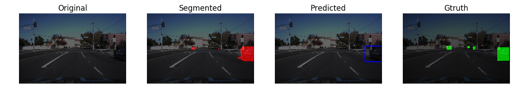


```python
test_img = 'scene01021.jpg'
im = cv2.imread(test_img)
im = cv2.cvtColor(im,cv2.COLOR_BGR2RGB)
pred,im = next_img(im)
im  = np.array(im,dtype= np.uint8)
im_pred = np.array(255*pred[0],dtype=np.uint8)
rgb_mask_pred = cv2.cvtColor(im_pred,cv2.COLOR_GRAY2RGB)
rgb_mask_pred[:,:,1:3] = 0*rgb_mask_pred[:,:,1:2]

img_pred = cv2.addWeighted(rgb_mask_pred,0.70,im,1,0)

draw_img = get_BB_new_img(im)

plt.figure(figsize=(14,5))
plt.subplot(1,3,1)
plt.imshow(im)
plt.title('Original')
plt.axis('off')
plt.subplot(1,3,2)
plt.imshow(img_pred)
plt.title('Segmentated')
plt.axis('off')
plt.subplot(1,3,3)
plt.imshow(draw_img)
plt.title('Bounding Box')
plt.axis('off');


```


## Performing camera calibration
Camera calibration is performed in order to correct the deformation in the images that is caused to the optic lens curvature. The first step is to print a chessboard and take random pictures of it. Then count the chess intersecting squires to provide "objp" which holds the (x,y,z) coordinates of these corners. Z=0 here and the object points are the same for all images in the calibration folder. The objpoints will be appended in "objp" every time the method successfully detect all chessboard corners in a test image. "imgpoints" will be appended with the (x, y) pixel position of each of the corners in the image plane with each successful chessboard detection.
"objpoints" and "imgpoints" were used to compute the camera calibration and distortion coefficients using the "cv2.calibrateCamera()" function on a test image in "cv2.undistort()"


```python
# prepare object points. The number of corners are 6x9
objp = np.zeros((6*9,3), np.float32)
objp[:,:2] = np.mgrid[0:9, 0:6].T.reshape(-1,2)
# Arrays to store object points and image points from all the images.
objpoints = [] # 3d points in real world space
imgpoints = [] # 2d points in image plane.
# Make a list of calibration images, all located in camera_cal
images = glob.glob('camera_cal/calibration*.jpg')
# Step through the list and search for chessboard corners
for idx, fname in enumerate(images):
    img = cv2.imread(fname)
    # imread reads images in BGR format
    gray = cv2.cvtColor(img, cv2.COLOR_BGR2GRAY)
    # Find the chessboard corners
    ret, corners = cv2.findChessboardCorners(gray, (9,6), None)
    # If found, add object points, image points
    if ret == True:
        objpoints.append(objp)
        imgpoints.append(corners)
        #Draw and display the corners
        cv2.drawChessboardCorners(img, (9,6), corners, ret)
        #write_name = 'corners_found'+str(idx)+'.jpg'
        #cv2.imwrite(write_name, img)
        #cv2.imshow('img', img)
        #cv2.waitKey(500)
#cv2.destroyAllWindows()
```

## Perform distortion removal on test images¶
1. Has the distortion correction been correctly applied to each image?
Undistortion is performed on the provided test images before they are used in the pipeline. This also applies to the video frames. "dst" holds undistorted frames from "cv2.undistort" that were computed using "mtx".


```python
for image_name in glob.glob("Frames/*"):
    im = cv2.imread(image_name)
    im = cv2.cvtColor(im,cv2.COLOR_BGR2RGB)
    im = undistort(im,read=False, display = False, write = False)
    pred,im = next_img(im)
    im  = np.array(im,dtype= np.uint8)
    im_pred = np.array(255*pred[0],dtype=np.uint8)
    rgb_mask_pred = cv2.cvtColor(im_pred,cv2.COLOR_GRAY2RGB)
    rgb_mask_pred[:,:,1:3] = 0*rgb_mask_pred[:,:,1:2]
    img_pred = cv2.addWeighted(rgb_mask_pred,0.50,im,1,0)
    draw_img = get_BB_new_img(im)
    plt.figure(figsize=(14,5))
    plt.subplot(1,3,1)
    plt.imshow(im)
    plt.title('Original')
    plt.axis('off')
    plt.subplot(1,3,2)
    plt.imshow(img_pred)
    plt.title('Segmentated')
    plt.axis('off')
    plt.subplot(1,3,3)
    plt.imshow(draw_img)
    plt.title('Bounding Box')
    plt.axis('off');

heatmap_10 = [np.zeros((640,960))]*10
    
```


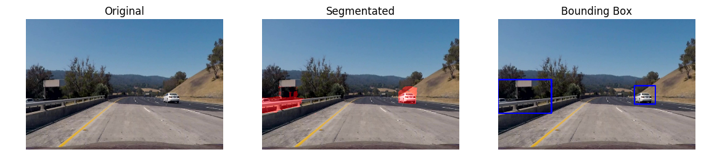


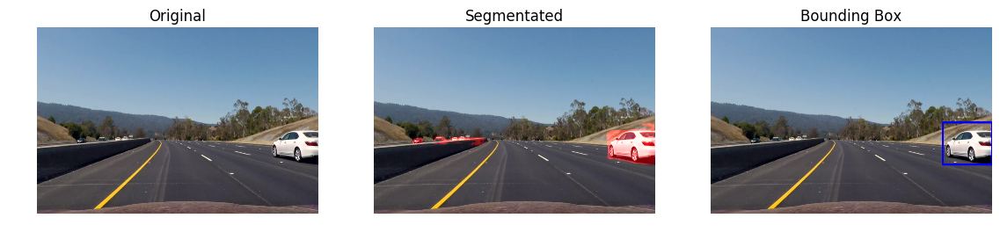


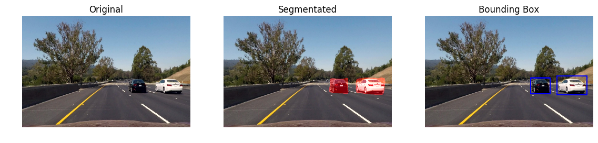


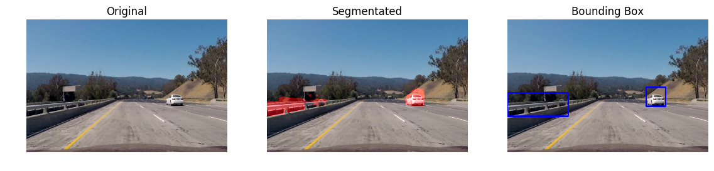


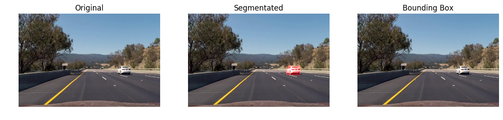


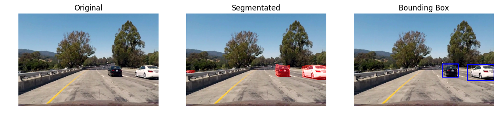


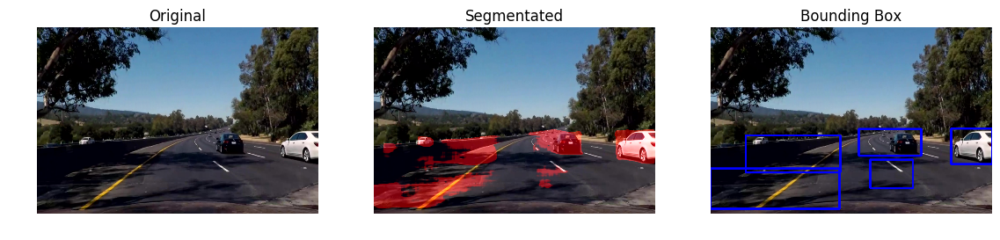


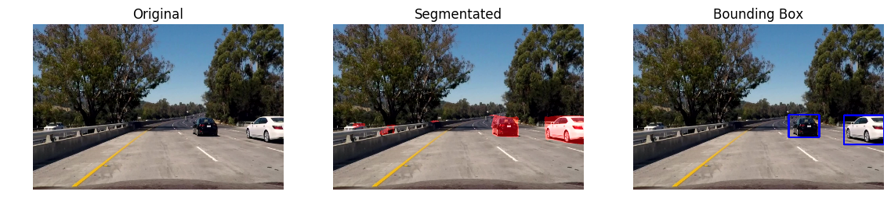


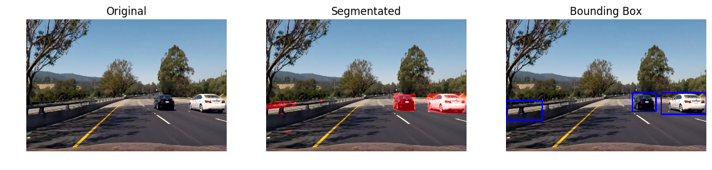


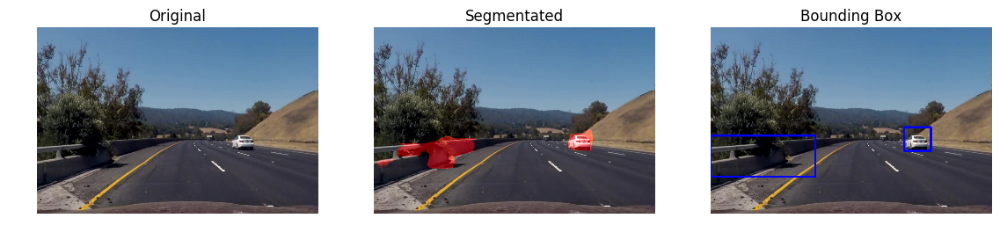


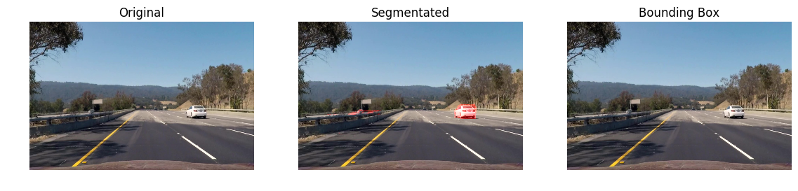


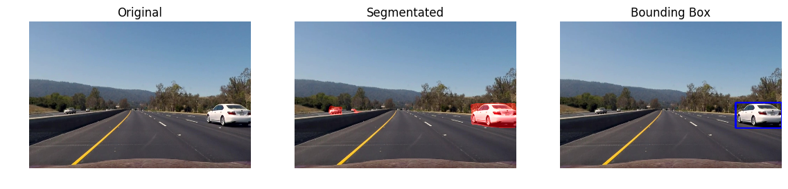


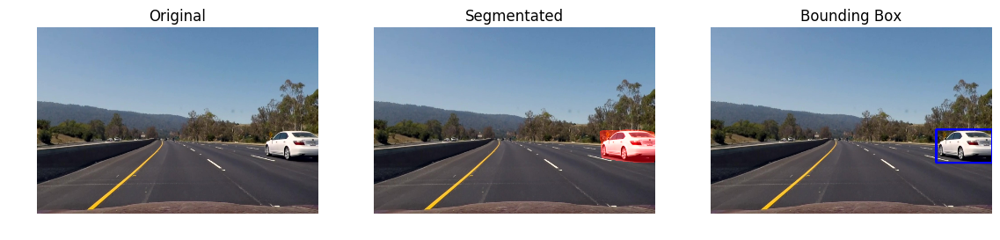


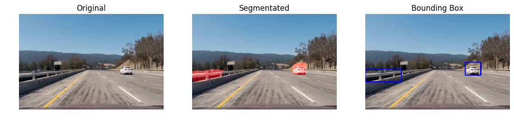


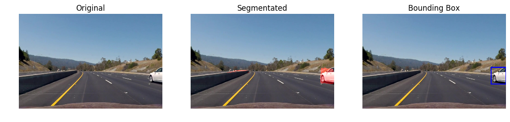


```python
def video_pipeline(image):
    #test_img = 'scene01021.jpg'
    #im = cv2.imread(im)
    #im = cv2.cvtColor(im,cv2.COLOR_BGR2RGB)
    #img = get_BB_new_img(im)
    # Apply bounding box to image
    image_bb = np.copy(image)
    bbox_cars = get_BB_new(image_bb)
    img_size = np.shape(image)
    result = image
    img_res_shape = result.shape
    for bbox in bbox_cars:
        cv2.rectangle(result,(np.int32(bbox[0][0]*img_res_shape[1]/960),np.int32(bbox[0][1]*img_res_shape[0]/640)), (np.int32(bbox[1][0]*img_res_shape[1]/960),np.int32(bbox[1][1]*img_res_shape[0]/640)),(0,255,0),6)
    #heatmap = get_Unet_mask(image_bb)
    #plt.imshow(img)
    return result
```


```python
video_output = 'project_video_output.mp4'
clip1 = VideoFileClip("project_video.mp4")
white_clip = clip1.fl_image(video_pipeline) 
white_clip.write_videofile(video_output, audio=False)
```

    [MoviePy] >>>> Building video project_video_output.mp4
    [MoviePy] Writing video project_video_output.mp4


    100%|█████████▉| 1260/1261 [1:13:58<00:04,  4.56s/it]  | 1/1261 [00:02<1:00:02,  2.86s/it]


    [MoviePy] Done.
    [MoviePy] >>>> Video ready: project_video_output.mp4 
    


```python
from IPython.display import HTML
HTML("""
<video width="640" height="360" controls>
  <source src="{0}">
</video>
""".format('project_video_output.mp4'))
```


<video width="640" height="360" controls>
  <source src="project_video_output.mp4">
</video>


